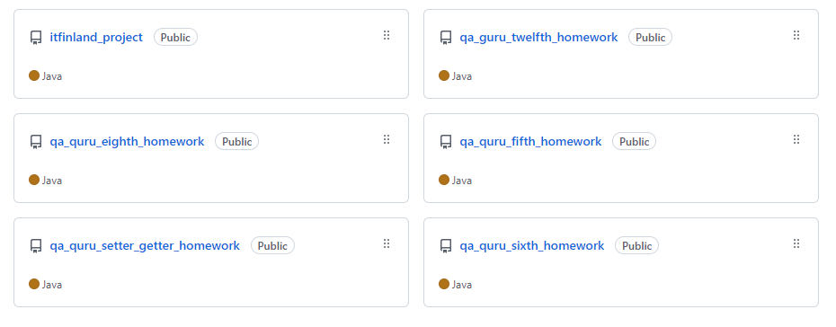

### Hi there :raised_hand_with_fingers_splayed: Welcome to my GitHub page!

I'm Elena Komarova and I'm Senior QA (Full stack QA) engineer.

I have been working in QA manual for 8 years and in QA full stack for 1,5 years. And I love my job so much :heart_eyes_cat:

___

### My card in GitHub

___

### I suggest you familiarize yourself with my projects in github :grinning::

  

As you can look, there's a lot qa guru homeworks projects. The reason is simple - I'm studying in qa.guru for QA automation. And now I'm interested in improving my skills in this scope.

___

### Contacts

Welcome!
+ [Telegram](https://t.me/elena_aeternanox)
+ [Linkedin](https://www.linkedin.com/in/elena-komarova-b728041b8/)
+ [Email](mailto:antares87@mail.ru)

